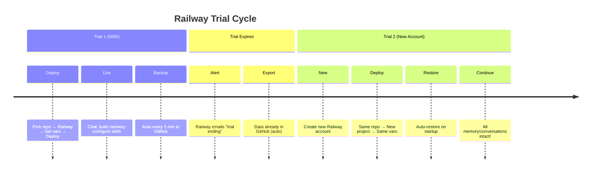

# Hermes Agent on Railway - Complete Deployment Template

> **Deploy Hermes Agent to Railway with automatic backup/restore to GitHub.**
> When your trial expires, deploy to a new Railway account and restore all your conversations, memory, and settings instantly.

---

## 🎯 What This Does

| Feature | Description |
|---------|-------------|
| **Full Hermes Agent** | Complete gateway with all skills, tools, and memory |
| **Auto Backup** | Persists `~/.hermes` (sessions, memory, config) to GitHub every 5 min |
| **Auto Restore** | On new deployment, restores all data from GitHub automatically |
| **Multi-Provider** | Ollama Cloud (primary), Groq (fallback), OpenCode Zen (optional) |
| **Trial-Proof** | When Railway trial expires → new account → deploy → restore → continue |
| **Two Modes** | `gateway` (full agent, ~500MB) or `listener` (lightweight, ~100MB) |

---

## 🚀 Quick Deploy (3 Steps)

### 1. Fork This Repository
Click **Fork** → your GitHub account → `yourusername/hermes-ondemand`

### 2. Create GitHub Personal Access Token
1. Go to [GitHub Settings → Tokens](https://github.com/settings/tokens)
2. **Generate new token (classic)** → scope: `repo` (full repo access)
3. Copy the token (starts with `ghp_`)

### 3. Deploy to Railway
[](https://railway.app/template/your-template-id)

**Or manually:**
1. Go to [Railway Dashboard](https://railway.app/dashboard)
2. **New Project** → **Deploy from GitHub repo** → select your fork
3. Railway auto-detects `Dockerfile` / `railway.json`

---

## ⚙️ Required Environment Variables

Set these in **Railway Dashboard → Variables** tab:

| Variable | Required | Description | Example |
|----------|:--------:|-------------|---------|
| `TELEGRAM_BOT_TOKEN` | ✅ | From [@BotFather](https://t.me/BotFather) | `123456:ABC-DEF...` |
| `TELEGRAM_ALLOWED_USERS` | ✅ | Your Telegram user ID(s), comma-separated | `123456789,987654321` |
| `GH_PAT` | ✅ | GitHub PAT with `repo` scope | `ghp_xxxxxxxxxxxx` |
| `GH_REPO` | ✅ | Your fork: `owner/repo` | `yourusername/hermes-ondemand` |
| `OLLAMA_API_KEY` | ✅* | From [ollama.com/settings/keys](https://ollama.com/settings/keys) | `ollama_xxxxx` |
| `GROQ_API_KEY` | | Fallback provider | `gsk_xxxxx` |
| `OPENCODE_ZEN_API_KEY` | | Alternative free provider | `ocz_xxxxx` |
| `MODEL_PROVIDER` | | `ollama-cloud` \| `groq` \| `opencode-zen` | `ollama-cloud` |
| `DEFAULT_MODEL` | | Model ID for provider | `gemma4:31b-cloud` |
| `TELEGRAM_CHAT_ID` | | Optional: specific chat for notifications | `123456789` |
| `DATA_BRANCH` | | Git branch for backups (auto-created) | `railway-data` |
| `MODE` | | `gateway` (full) or `listener` (lite) | `gateway` |

> **At least one AI provider key is required.** Ollama Cloud recommended (generous free tier).

---

## 🔄 Backup/Restore Workflow

### Automatic (Default)
```
Railway Deploy → Entrypoint runs → Restores from GitHub → Starts Gateway
                    ↓
            Every 5 min → Backups to GitHub (data branch)
                    ↓
         Trial expires → New Railway account → Deploy same repo
                    ↓
            Auto-restore → All conversations/memory intact!
```

### Manual Commands (via Railway CLI)
```bash
# Install Railway CLI
npm i -g @railway/cli
railway login

# Link to your project
railway link

# Manual backup
railway run bash scripts/backup-railway.sh

# Manual restore (on new deployment)
railway run bash scripts/restore-railway.sh

# View logs
railway logs
```

### SSH into Container
```bash
railway shell
# Inside container:
bash scripts/restore-railway.sh
bash scripts/backup-railway.sh
```

---

## 🏗️ Architecture

```
┌─────────────────────────────────────────────────────────────┐
│                    Railway Container                        │
│  ┌─────────────────────────────────────────────────────┐   │
│  │              railway-entrypoint.sh                  │   │
│  │  ┌─────────────┐  ┌──────────────┐  ┌───────────┐  │   │
│  │  │ 1. Restore  │→ │ 2. Config    │→ │ 3. Reset  │  │   │
│  │  │ from GitHub │  │    (secrets) │  │  Overrides│  │   │
│  │  └─────────────┘  └──────────────┘  └───────────┘  │   │
│  └──────────────────────────┬──────────────────────────┘   │
│                             │                               │
│              ┌──────────────┴──────────────┐               │
│              ▼                             ▼               │
│       ┌─────────────┐               ┌─────────────┐        │
│       │  GATEWAY    │               │  LISTENER   │        │
│       │  (Full)     │               │  (Lite)     │        │
│       │  hermes     │               │  bot.py     │        │
│       │  gateway    │               │  (triggers  │        │
│       │  ~500MB     │               │   GH Actions)│       │
│       └─────────────┘               └─────────────┘        │
│              │                             │               │
│              └──────────────┬──────────────┘               │
│                             ▼                               │
│                    ┌─────────────────┐                     │
│                    │  Auto Backup    │                     │
│                    │  (every 5 min)  │                     │
│                    │  → GitHub data  │                     │
│                    │     branch      │                     │
│                    └─────────────────┘                     │
└─────────────────────────────────────────────────────────────┘
                              │
                              ▼
                 ┌────────────────────────┐
                 │   GitHub Repository    │
                 │  (your fork)           │
                 │  Branch: railway-data  │
                 │  - state.db            │
                 │  - memory/             │
                 │  - config.yaml         │
                 │  - sessions/           │
                 └────────────────────────┘
```

---

## 📁 Project Structure

```
hermes-ondemand/
├── Dockerfile                    # Multi-stage Railway build
├── railway.json                  # Railway deployment config
├── nixpacks.toml                 # Alternative Nixpacks config
├── .env.example                  # Environment variables template
├── scripts/
│   ├── railway-entrypoint.sh     # Main entrypoint (restore→config→run)
│   ├── restore-railway.sh        # Manual restore script
│   ├── backup-railway.sh         # Manual backup script
│   ├── patch-typehandler.py      # Fixes Telegram TypeHandler bug
│   ├── keepalive.sh              # GitHub Actions keep-alive (legacy)
│   ├── persist.sh                # GitHub Actions persist (legacy)
│   └── selfheal.sh               # Self-healing helper (legacy)
├── listener/                     # Lightweight trigger bot
│   ├── bot.py                    # Telegram polling bot
│   ├── requirements.txt          # Python deps (requests)
│   └── .env.example
├── .github/workflows/            # GitHub Actions (legacy/alternative)
│   ├── hermes.yml                # On-demand workflow
│   ├── keepalive.yml             # 24/7 keep-alive
│   └── orchestrate-azzavision.yml
└── eggs/                         # Pterodactyl deployment eggs
    ├── hermes-gateway.json
    └── hermes-listener.json
```

---

## 🔧 Advanced Configuration

### Custom Model Provider
```yaml
# In Railway Variables or .env
MODEL_PROVIDER=opencode-zen
DEFAULT_MODEL=deepseek-v4-flash-free
BASE_URL=https://opencode.ai/zen/v1
OPENCODE_ZEN_API_KEY=your_key
```

### Memory Limits
The entrypoint writes `config.yaml` with these defaults:
```yaml
memory:
  memory_enabled: true
  user_profile_enabled: true
  memory_char_limit: 5000
  user_char_limit: 4000
```
Override by setting `MEMORY_CHAR_LIMIT` and `USER_CHAR_LIMIT` env vars (requires code change).

### Backup Frequency
```bash
# Railway Variables
BACKUP_EVERY_SEC=300  # 5 minutes (default)
BACKUP_EVERY_SEC=600  # 10 minutes
```

---

## 🐛 Troubleshooting

### "Gateway failed to start"
```bash
railway logs
# Check for:
# - Missing TELEGRAM_BOT_TOKEN
# - Invalid AI provider API key
# - Port binding issues (Railway assigns PORT automatically)
```

### "Restore failed / no data branch"
- **First deploy:** Normal! No backup exists yet. Gateway creates branch on first backup.
- **Subsequent deploys:** Check `GH_PAT` has `repo` scope, `GH_REPO` format is `owner/repo`

### "TypeHandler / Any cannot be instantiated"
- Fixed automatically by `patch-typehandler.py` during build
- If persists, check Railway logs for patch output

### "Out of memory" (OOM)
- Railway free tier: 512MB RAM
- Use `MODE=listener` for lighter deployment (~100MB)
- Or upgrade Railway plan

### Telegram bot not responding
1. Check `TELEGRAM_ALLOWED_USERS` includes your user ID
2. Get your ID: message [@userinfobot](https://t.me/userinfobot)
3. Check Railway logs for "Gateway up" message

---

## 🔒 Security Notes

| Secret | Where Stored | Access |
|--------|--------------|--------|
| `TELEGRAM_BOT_TOKEN` | Railway Variables (encrypted) | Runtime only |
| `GH_PAT` | Railway Variables (encrypted) | Runtime only |
| AI API Keys | Railway Variables (encrypted) | Runtime only |
| `state.db` | GitHub data branch (private repo) | Encrypted at rest |
| Conversations | GitHub data branch (private repo) | Encrypted at rest |

> **Important:** Keep your fork **private** if storing conversations. The data branch contains your chat history.

---

## 💡 Trial Expiry Strategy



---

## 📝 License & Credits

- **Hermes Agent**: [NousResearch/hermes-agent](https://github.com/NousResearch/hermes-agent)
- **Deployment Template**: Based on [azascloud-cell/hermes-ondemand](https://github.com/azascloud-cell/hermes-ondemand)
- **Railway**: [railway.app](https://railway.app)

---

## 🆘 Support

- **Issues**: [GitHub Issues](https://github.com/yourusername/hermes-ondemand/issues)
- **Hermes Docs**: [hermes-agent.nousresearch.com/docs](https://hermes-agent.nousresearch.com/docs)
- **Railway Docs**: [docs.railway.app](https://docs.railway.app)

---

**Happy deploying! 🚂✨**